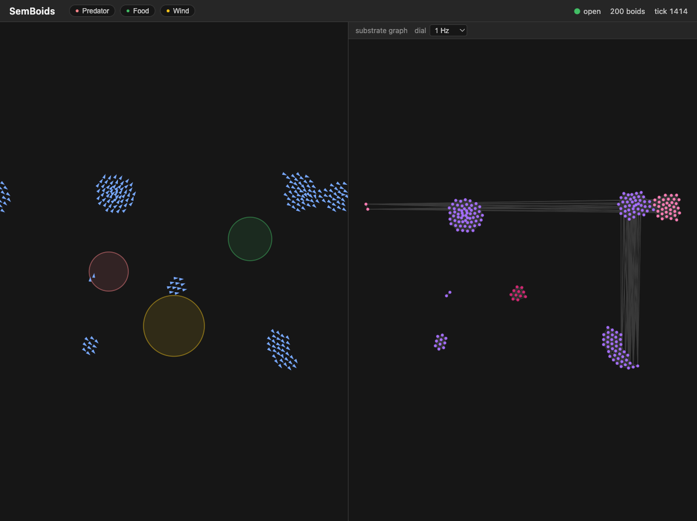

# SemBoids

A classic [Reynolds boids](https://www.red3d.com/cwr/boids/) simulator for the
C360 `sem*` family — a celebration of simple-yet-detailed over complex: three
steering rules (separation, cohesion, alignment) producing emergent flocking.



Built on [SemStreams](https://github.com/c360studio/semstreams). Physics runs
in-process at 30Hz; the substrate does what it's good at — **rule-driven zone
steering** (boids flee predator zones, pool at food, drift in wind — each a
SemStreams JSON rule you can toggle live from the UI), zones as graph
entities, live graph snapshots at a tunable cadence feeding a sigma.js pane
where LPA communities color the flocks, and websocket egress to the
split-screen UI. Lifecycle-managed spawn/despawn comes next.

SemBoids is also a calibrated load generator: the graph-ingest cadence is a
dial we crank to profile SemStreams under a fast-moving graph (pprof +
Prometheus). Substrate findings are filed upstream. Baseline profile:
[docs/perf/baseline-200boids-30hz.md](docs/perf/baseline-200boids-30hz.md).

## Quick start

```bash
task dev:nats:start        # NATS 2.12 with JetStream on :4222
go run ./cmd/semboids --config configs/flock.json --debug
cd ui && npm install && npm run dev   # UI on http://localhost:5173
```

Flags: `--boids N --tick-hz HZ --seed N` override the config;
`--debug` enables pprof on :6060. Metrics on :9090, API on :8080,
frame stream on :8081/ws.

## Status

Zone steering complete (`add-zone-steering`): predator/food/wind zones live
as graph entities via graph-ingest, the sim publishes edge-triggered
transition events, six SemStreams expression rules translate them into
TTL'd steering modifiers applied inside the physics force budget, and the
UI renders zone overlays, modifier-tinted boids, and live rule toggles.
Rule-engine performance under the demo:
[docs/perf/zone-steering-rules.md](docs/perf/zone-steering-rules.md)
(~3.9µs/rule evaluation). Earlier: walking skeleton (`add-flock-core`) with
the in-process engine (~114µs/tick at 200 boids) and baseline profile.
Architecture fixed in
[ADR-001](docs/adr/001-hybrid-physics-substrate-split.md); work proceeds
through [OpenSpec](openspec/README.md) changes.

Complete: the split screen — Canvas 2D flock on the left, the substrate's own graph on the right (sigma.js at real positions, LPA communities coloring flocks, a runtime load dial). semstreams beta.137 fixed [#466](https://github.com/C360Studio/semstreams/issues/466) (predicate-level Graphable merge), verified live.

Complete (`load-dial`): the dial now outruns the thing it measures. The
snapshot publisher batches a whole snapshot as one async publish
([semstreams#470](https://github.com/C360Studio/semstreams/issues/470),
adopted in beta.138), lifting the old ~22 snapshots/s *instrument* ceiling —
200 boids at 30Hz now hits 30/30 with zero drops, and holds zero drops to
2000 boids. With the instrument out of the way, the formal campaign
([docs/perf/melt-campaign-2026-07-05.md](docs/perf/melt-campaign-2026-07-05.md))
found the *substrate's* wall: graph-ingest saturates at ~500 entity/s,
round-trip-latency bound with the box 92% idle — filed as
[#480](https://github.com/C360Studio/semstreams/issues/480). JetStream
consumer-lag + end-to-end ingest-latency metrics on :9090 and a `task sweep`
harness make the attribution reproducible.

Roadmap: lifecycle spawn/despawn (`add-lifecycle-population`).

Upstream findings filed from this repo:
[semstreams#452](https://github.com/C360Studio/semstreams/issues/452) (docs),
[#455](https://github.com/C360Studio/semstreams/issues/455) (rule hot-reload
unreachable over HTTP — **fixed in beta.135**),
[#459](https://github.com/C360Studio/semstreams/issues/459) (config bucket
collision on shared NATS),
[#461](https://github.com/C360Studio/semstreams/issues/461) (clustering
virtual edges not configurable — **fixed in beta.136**),
[#470](https://github.com/C360Studio/semstreams/issues/470) (async/pipelined
publish — **landed beta.138**, adopted),
[#480](https://github.com/C360Studio/semstreams/issues/480) (graph-ingest
ingest caps ~500 msg/s — serial dispatch + 2-RTT CAS write).

## Development

See [CLAUDE.md](CLAUDE.md) for architecture, conventions, and common tasks.
`task check` before pushing; `task check:push` mirrors CI.
