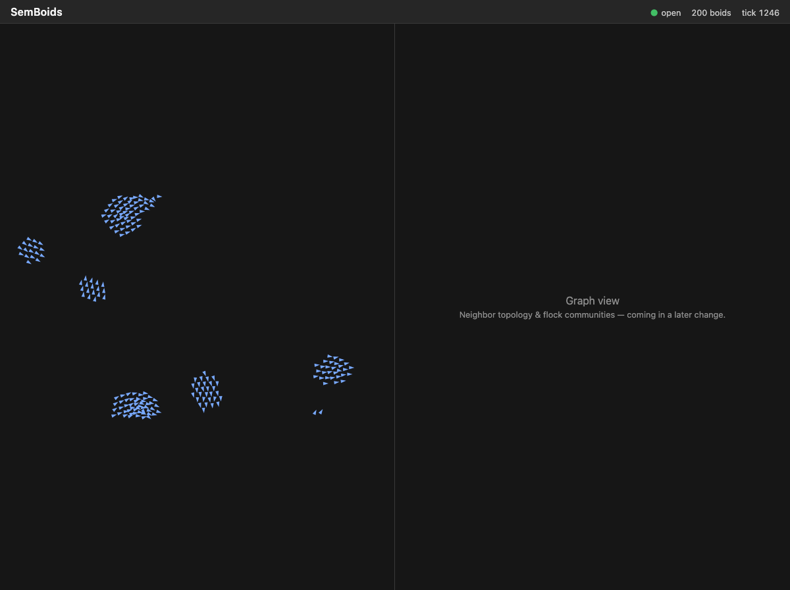

# SemBoids

A classic [Reynolds boids](https://www.red3d.com/cwr/boids/) simulator for the
C360 `sem*` family — a celebration of simple-yet-detailed over complex: three
steering rules (separation, cohesion, alignment) producing emergent flocking.



Built on [SemStreams](https://github.com/c360studio/semstreams). Physics runs
in-process at 30Hz; the substrate does what it's good at — websocket egress to
the split-screen UI today; rule-driven zone steering, lifecycle-managed
spawn/despawn, and graph snapshots with live flock community detection in
upcoming changes.

SemBoids is also a calibrated load generator: the graph-ingest cadence is a
dial we crank to profile SemStreams under a fast-moving graph (pprof +
Prometheus). Substrate findings are filed upstream. Baseline profile:
[docs/perf/baseline-200boids-30hz.md](docs/perf/baseline-200boids-30hz.md).

## Quick start

```bash
task dev:nats:start        # NATS 2.12 with JetStream on :4222
go run ./cmd/semboids --config configs/flock.json --debug
cd ui && npm install && npm run dev   # UI on http://localhost:5173
```

Flags: `--boids N --tick-hz HZ --seed N` override the config;
`--debug` enables pprof on :6060. Metrics on :9090, API on :8080,
frame stream on :8081/ws.

## Status

Walking skeleton complete (`add-flock-core`): in-process physics engine
(spatial hash, deterministic seeding, ~114µs/tick at 200 boids), sim as a
SemStreams input component publishing one frame per tick, websocket egress,
and a Canvas 2D pane rendering live flocking. Architecture fixed in
[ADR-001](docs/adr/001-hybrid-physics-substrate-split.md); work proceeds
through [OpenSpec](openspec/README.md) changes.

Roadmap: zone steering rules → graph snapshots + sigma.js pane with LPA flock
communities → lifecycle spawn/despawn → load-dial profiling harness.

## Development

See [CLAUDE.md](CLAUDE.md) for architecture, conventions, and common tasks.
`task check` before pushing; `task check:push` mirrors CI.
