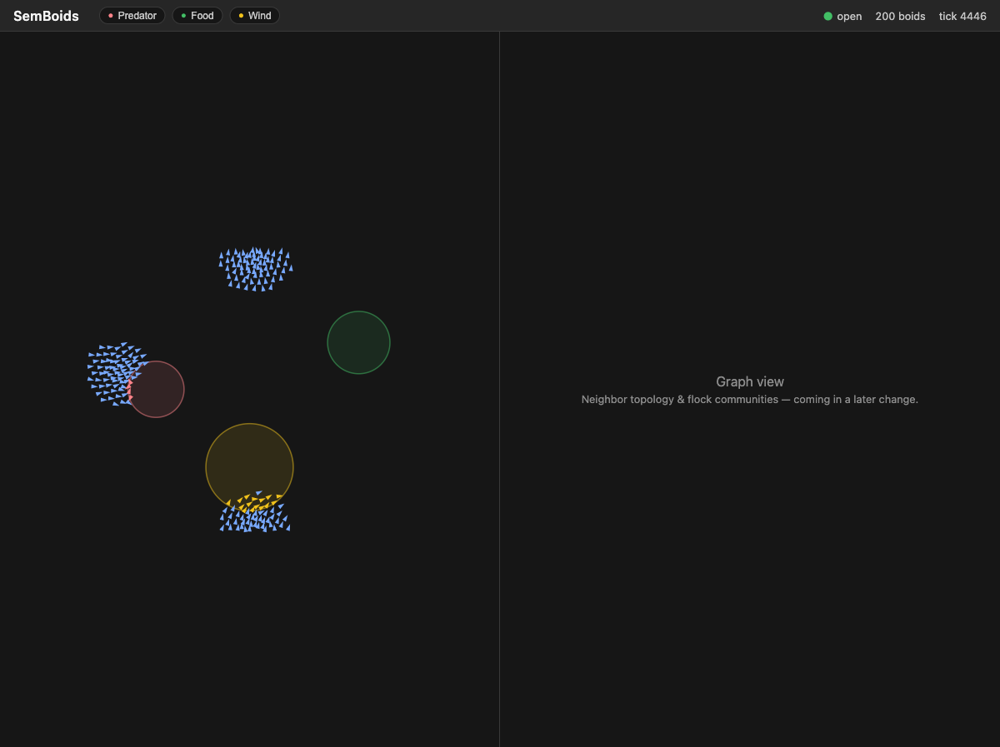

# SemBoids

A classic [Reynolds boids](https://www.red3d.com/cwr/boids/) simulator for the
C360 `sem*` family — a celebration of simple-yet-detailed over complex: three
steering rules (separation, cohesion, alignment) producing emergent flocking.



Built on [SemStreams](https://github.com/c360studio/semstreams). Physics runs
in-process at 30Hz; the substrate does what it's good at — **rule-driven zone
steering** (boids flee predator zones, pool at food, drift in wind — each a
SemStreams JSON rule you can toggle live from the UI), zones as graph
entities, and websocket egress to the split-screen UI. Lifecycle-managed
spawn/despawn and graph snapshots with live flock community detection come in
upcoming changes.

SemBoids is also a calibrated load generator: the graph-ingest cadence is a
dial we crank to profile SemStreams under a fast-moving graph (pprof +
Prometheus). Substrate findings are filed upstream. Baseline profile:
[docs/perf/baseline-200boids-30hz.md](docs/perf/baseline-200boids-30hz.md).

## Quick start

```bash
task dev:nats:start        # NATS 2.12 with JetStream on :4222
go run ./cmd/semboids --config configs/flock.json --debug
cd ui && npm install && npm run dev   # UI on http://localhost:5173
```

Flags: `--boids N --tick-hz HZ --seed N` override the config;
`--debug` enables pprof on :6060. Metrics on :9090, API on :8080,
frame stream on :8081/ws.

## Status

Zone steering complete (`add-zone-steering`): predator/food/wind zones live
as graph entities via graph-ingest, the sim publishes edge-triggered
transition events, six SemStreams expression rules translate them into
TTL'd steering modifiers applied inside the physics force budget, and the
UI renders zone overlays, modifier-tinted boids, and live rule toggles.
Rule-engine performance under the demo:
[docs/perf/zone-steering-rules.md](docs/perf/zone-steering-rules.md)
(~3.9µs/rule evaluation). Earlier: walking skeleton (`add-flock-core`) with
the in-process engine (~114µs/tick at 200 boids) and baseline profile.
Architecture fixed in
[ADR-001](docs/adr/001-hybrid-physics-substrate-split.md); work proceeds
through [OpenSpec](openspec/README.md) changes.

In flight: `add-graph-pane` — graph snapshots at a tunable cadence (the
load dial v1), LPA flock communities, and the sigma.js pane. Spikes
complete on semstreams beta.136 (which fixed
[#461](https://github.com/C360Studio/semstreams/issues/461) same-day —
`entity_id_edges` now lets LPA run on explicit flock topology). Since
beta.135 fixed
[#455](https://github.com/C360Studio/semstreams/issues/455), the UI rule
toggles flip the **actual zone-steering rules** via runtime reconfiguration
(the earlier app-side gate is gone; active modifiers still clear instantly
on disable).

Roadmap: graph pane → lifecycle spawn/despawn → load-dial profiling
harness.

Upstream findings filed from this repo:
[semstreams#452](https://github.com/C360Studio/semstreams/issues/452) (docs),
[#455](https://github.com/C360Studio/semstreams/issues/455) (rule hot-reload
unreachable over HTTP — **fixed in beta.135**),
[#459](https://github.com/C360Studio/semstreams/issues/459) (config bucket
collision on shared NATS),
[#461](https://github.com/C360Studio/semstreams/issues/461) (clustering
virtual edges not configurable).

## Development

See [CLAUDE.md](CLAUDE.md) for architecture, conventions, and common tasks.
`task check` before pushing; `task check:push` mirrors CI.
